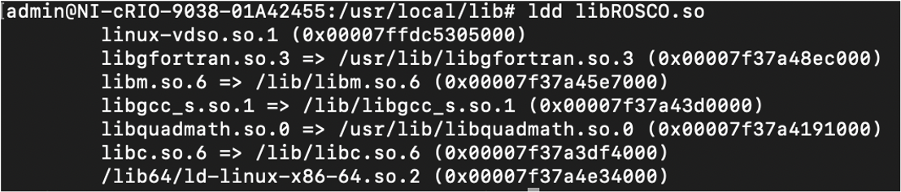

# FOCAL LabVIEW Control Code and ROSCO interface

## Overview
The FOCAL wind turbine control is implemented in LabVIEW real-time. Pull the latest LabVIEW code from this repo, open the LabVIEW project in LabVIEW 2018, and execute the latest version of the FocalMainVX.vi. 

The LabVIEW code integrates with the NREL ROSCO controller. The ROSCO controller is written in FORTRAN. To use this controller in LabVIEW RT on the cRIO, a number of setup steps are required on the cRIO. This includes both C and FORTRAN compilers as outlined below.

## Installing gcc on the cRIO
The cRIO uses a Linux based operating system. To access the cRIO, ssh into the cRIO as follows:
```bash
ssh admin@192.168.86.28
```
where the cRIO IP address can be obtained using NI MAX, and the password is as set via the cRIO browser interface (default password is empty). Once on the cRIO, check the installed OS
```bash
uname -a
```
which for the EGI cRIO returns as
```bash
Linux NI-cRIO-9038-01A42455 4.9.47-rt37-6.1.0f0 #1 SMP PREEMPT RT Sat Jun 9 13:19:07 CDT 2018 x86_64 GNU/Linux
```
The EGI cRIO uses Linux Kernel 4.9.47 (with LabVIEW 2018 install).

Before installation, check if the cRIO is connected to the internet
```bash
ping 8.8.8.8
```
which should return traffic (via www.google.com). 

To install gcc, run the following sequence of commands one-by-one
```bash
opkg update
opkg ldd
opkg install gcc gcc-symlinks
opkg install cpp cpp-symlinks
opkg install g++ g++-symlinks
opkg install libc6-utils
opkg install binutils
```
Each of those commands should result in a successful installation of the components listed. The first command is key, as this establishes the link to the NI package repository. The return from this opkg update command should look something like:
```bash
Downloading http://download.ni.com/ni-linux-rt/feeds/2018.5/x64/all/Packages.gz.
Updated source 'uri-all-0'.
Downloading http://download.ni.com/ni-linux-rt/feeds/2018.5/x64/core2-64/Packages.gz.
Updated source 'uri-core2-64-0'.
Downloading http://download.ni.com/ni-linux-rt/feeds/2018.5/x64/x64/Packages.gz.
Updated source 'uri-x64-0'.
```

## Testing gcc on the cRIO
At this stage, we can check if the gcc compile tools work as expected. Copy the file main_hello.c from the c-interface-test folder to the cRIO. Copying the file from the host PC to the cRIO can be done using scp, with an example given below:
```bash
scp main_hello.c admin@192.168.86.28:/home/admin/rosco/c-interface-test
```
To compile and run this file, navigate to the correct directory on the cRIO (/home/admin/rosco/c-interface-test in the above example) and
```bash
gcc main_hello.c -o cRIOHello
./cRIOHello
```
which should return
```bash
Hello World. The cRIO has a working C compiler now ...
```

## Installing gFortran on the cRIO
The NI cRIO package manager (as used for gcc install above) does unfortunately NOT include packages required for gFortran. EGI created these packages by creating a Docker container of the NI cRIO environment. All required packages, or ipk files, are located in the ipk-gfortran-2018 directory. Copy these files to the cRIO, and install in the following order:
```bash
opkg install libquadmath0_6.3.0-r0_core2-64.ipk
opkg install libquadmath-dev_6.3.0-r0_core2-64.ipk
opkg install libgfortran3_6.3.0-r0_core2-64.ipk
opkg install libgfortran-dev_6.3.0-r0_core2-64.ipk
opkg install gfortran_6.3.0-r0_core2-64.ipk
opkg install gfortran-symlinks_6.3.0-r0_core2-64.ipk
```

## To use Sourcetree/Github desktop 

Labview provides a Merge and Diff tool which can be integrated with source control GUIs. To do this in Sourcetree, 

* Download LVMerge and LVDiff shell scripts
* Place them at C:\Program Files\Git\bin
* In Sourcetree > Tools > Options > Diff
* In External Diff Tool choose > Custom
* Diff Command: C:\Program Files\Git\bin_LVCompareWrapper.sh
* You can click on the file, Right Click > External Diff > Show Difference

## To Compile ROSCO code on cRIO

* Needs gfortran installed on cRIO

	* Copy ipk files to cRIO
	* opkg install libquadmath0_6.3.0 ...
	* opkg install libgfortran3_6.3.0 ...
	* opkg install libgfortran-dev_6.3.0 ...
	* opkg install libmpft4_3.1.5 ...
	* opkg install libmpc3_1.0.3 ...
	* opkg install gfortan_6.3.0 ...
	* opkg install gfortran-symlinks_6.3.0 ...

* libdiscon dependencies:


* Download the shell script from fortranScript/compile-fortran onto the cRIO
* Download the rosco source code from (https://github.com/nrel/rosco) and make changes as needed.

	* mkdir build
	* cd build
	* ./compile-fortran.sh libdiscon20200910 <name you want to give the shared lib>
	* cp <so name> /usr/local/lib/.
	* copy the shared library using SCP tool onto the local computer. I use WinSCP.

* We have written a wrapper code in C, which calls the fortran shared library and acts as a bridge between Labview and ROSCO-Fortran.

* In Eclipse, Under Properties -> C/C++ Build -> Settings -> Cross GCC Linker
	* Click on Libraries. Change the -L (library search path) to the location of the shared library.
	* Click on Miscellaneous. Update the name of the library to your .so, which is copied from cRIO and placed under the path above. (ex.  -ldiscon_20201009)
	* Build the Eclipse code and copy the <eclipse so name>.so file to /usr/local/lib on cRIO using Eclipse

To know more about how to cross compile C code (for cRIO) using Eclipse - http://www.ni.com/tutorial/52578/en/ .

* Finally, on cRIO, run the below command
	/sbin/ldconfig -v

* To confirm that all the dependencies are installed on cRIO, 

	* cd /usr/local/lib
	* ldd <eclipse so name>.so 
